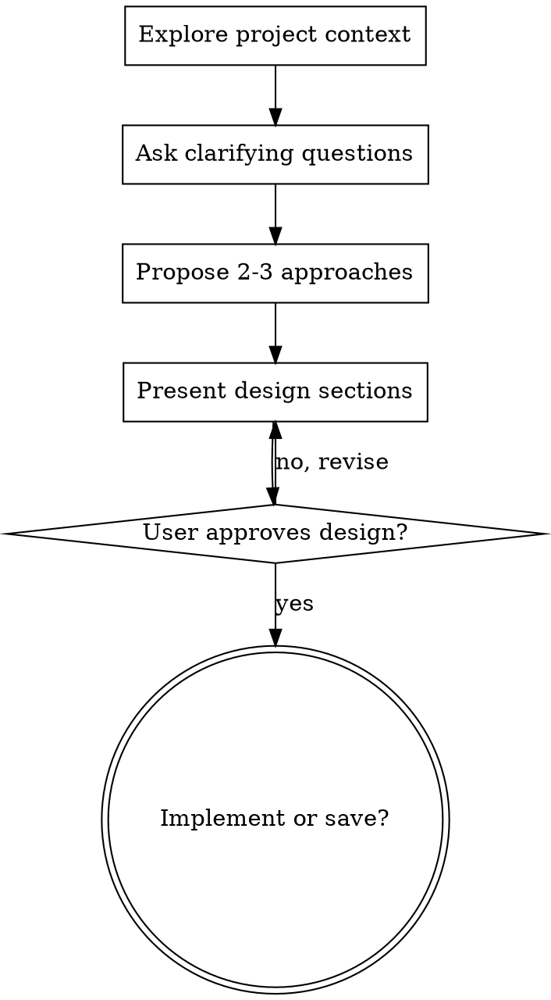

# Brainstorming Ideas Into Designs

## Overview

通过自然的协作式对话，把想法变成成形的设计和 spec。

先理解当前项目上下文，然后**一次问一个问题**逐步打磨想法。等你搞清楚要造什么了，呈现设计并拿用户批准。

何时使用（镜像 frontmatter，防截断）：开新功能前先聊聊、把想法理清楚、设计一下再写、想法变设计；范围明确的纯改 bug / 重构 / 文档 / 代码问答跳过本 skill。

<HARD-GATE>
在你呈现设计、且用户批准之前，不要调用任何实现类 skill、不要写任何代码、不要 scaffold 任何项目、不要采取任何实现动作。这条对每个项目都适用，无论看上去多简单。
</HARD-GATE>

## Anti-Pattern: "这太简单不需要设计"

每个项目都走这个流程。一个 todo list、一个单函数工具、一个配置改动——全都走。「简单」项目恰恰是未审视的假设造成最多白干的地方。设计可以很短（真简单的几句话即可），但你**必须**呈现它并拿到批准。

## Checklist（按步骤顺序执行）

你**必须**为以下每一步建一个 task，并按顺序完成：

- **步骤 1 — 探查项目上下文** —— 看文件、文档、最近 commit
- **步骤 2 — 逐题澄清** —— 一次一个问题，搞清目的/约束/成功标准（用 `AskUserQuestion` 工具，多选题优先）
- **步骤 3 — 提 2-3 个方案** —— 带 tradeoff，并给出你的推荐
- **步骤 4 — 呈现设计** —— 分节，每节篇幅按其复杂度伸缩，每节后拿用户确认
- **步骤 5 — 问用户** —— 直接实现，还是把设计存到 `docs/designs/YYYY-MM-DD-<topic>.md`

## Process Flow



**终态是问用户：**直接实现，还是把设计存到 `docs/designs/YYYY-MM-DD-<topic>.md`。不要自动 commit 或自动调用其他 skill。

## The Process

**理解想法：**
- 先看当前项目状态（文件、文档、最近 commit）
- 一次问一个问题来打磨想法
- 尽量用多选题（`AskUserQuestion`），开放题也行
- 每条消息只问一个问题——一个话题需要深挖就拆成多个问题
- 聚焦：目的、约束、成功标准

**探索方案：**
- 提 2-3 个不同方案，带 tradeoff
- 对话式呈现选项，给出你的推荐和理由
- 先抛你推荐的那个，解释为什么

**呈现设计：**
- 一旦你认为搞清了要造什么，呈现设计
- 每节篇幅按复杂度伸缩：直白的几句话，微妙的最多 200-300 字
- 每节后问一下到这是否对
- 覆盖：架构、组件、数据流、错误处理、测试
- 哪里说不通就随时回头澄清

## After the Design

问用户：
- **直接实现** —— 进入实现
- **存设计** —— 写到 `docs/designs/YYYY-MM-DD-<topic>.md`（不要 commit）

## 输出格式

设计文档（呈现或存盘）用以下骨架，每节按复杂度伸缩：

```
# <topic> 设计

## 目标 / 成功标准
<一句话目标 + 可验证的成功标准>

## 方案选型
<选定方案 + 为什么；被否方案一行带过>

## 架构与组件
<模块划分、关键文件路径>

## 数据流
<输入 → 处理 → 输出>

## 错误处理 / 边界
<会怎么坏、怎么兜>

## 测试
<怎么验证它真的对>
```

硬约束：未拿到用户对设计的批准前，不写代码、不调实现类 skill、不 commit。

## 示例输出（步骤 3 的方案对比片段）

```
我推荐 **方案 A：复用现有 jotai atom**，理由是改动面最小、和现有状态流一致。

- 方案 A（推荐）：复用 xxxAtom，新增一个派生 atom。代价：派生逻辑略绕。
- 方案 B：新开 context。代价：和现有 atom 体系割裂，多一套心智。
- 方案 C：组件内 local state。代价：跨组件共享时要提升，后面会返工。

要按方案 A 往下到设计吗？
```

## Key Principles

- **一次一个问题** —— 别用多个问题压垮用户
- **多选题优先** —— 比开放题好答（用 `AskUserQuestion`）
- **YAGNI 到底** —— 从所有设计里砍掉不必要的特性
- **探索备选** —— 落定前总是提 2-3 个方案
- **增量验证** —— 呈现设计，拿到批准再往下
- **保持灵活** —— 哪里说不通就回头澄清

## Codex compatibility

Preserve this workflow's intent and evidence rules. Translate Claude-specific tool names to the available Codex tools.
